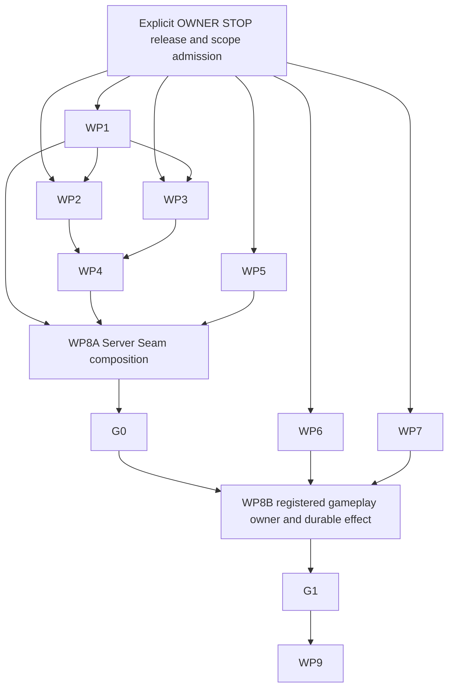

# Oteryn Game — audit remediation programme

- Programme: [#364](https://github.com/Oteryn/Oteryn-Game/issues/364)
- Product allocation/integration authority: [#162](https://github.com/Oteryn/Oteryn-Game/issues/162)
- Date: 2026-09-07
- Scope: complete remediation design and evidence reconciliation; product execution remains blocked by the current OWNER STOP.
- Design state: PREPARED, not an implementation allocation, architecture supersession, merge permission or production approval.

## 1. Objective and authority

Restore critical-path correctness, make its verification trustworthy, and reach the smallest real native client/server/durable proof. Retain native Rust, protocol-oteryn, WorldId/ChannelId separation, multichannel ownership, one logical authoritative mutation owner, generation/fencing and Game/Platform/Atlas boundaries. Do not redesign the architecture or complete every future MMO system before producing useful evidence.

This is the canonical programme design, finding/control mapping and package acceptance contract. #364 owns remediation progress and its latest checkpoint; existing Issues/PRs own their implementations and #162 owns allocations/integration. This file is an admission snapshot, not another mutable status database. Later evidence belongs on the owning issue/PR; update this design only for a material contract/dependency change.

FACT means directly retrieved repository state or an explicitly attributed audit observation. INFERENCE identifies a conclusion from that evidence. RECOMMENDATION is proposed work, not authorization. UNKNOWN must not become PASS without evidence. Historical native tests are not rerun tests on a newer head.

### Admission evidence

| Ref | Verified evidence and interpretation |
|---|---|
| S1 | Game protected main `b008614881fcc74f09e55e4d1b9e6c64ece04ce9`, tree `a97e1597308c3791697853c7a8e91a138b2b0ba4`. [Compare with audited product](https://github.com/Oteryn/Oteryn-Game/compare/7ce1d88ba7eb83033c4f0c11a5ccd1cb5030fac3...b008614881fcc74f09e55e4d1b9e6c64ece04ce9): one commit, only docs/agents/AGENTS.md, ANTI_STALL_AND_EXECUTION_BUDGET.md and PROMPTING_STANDARD.md changed. Product, workflow, Cargo and migration bytes did not change. |
| S2 | [Audit #359 / PR #360](https://github.com/Oteryn/Oteryn-Game/pull/360), head `d8a69a2fda51a8882c2e0d9bae61204f9cde163b`. Read README.md, findings.json, assessment.json, controls.json, prompt-traceability.json, review-scope.json and closeout-evidence.json in [the pinned report directory](https://github.com/Oteryn/Oteryn-Game/tree/d8a69a2fda51a8882c2e0d9bae61204f9cde163b/docs/agents/reports/repository-audit-20260906). It is published on that branch, still draft/unmerged, not present on admission main. |
| S3 | [Final publication readback](https://github.com/Oteryn/Oteryn-Game/pull/360#issuecomment-5562455292), later saved-work readback comment5564951752, and fresh exact-head workflow lookup: Merge gate run34061914161 SUCCESS; Agent governance34061914196 SUCCESS. Earlier same-head cancelled34061899444 is not the final result. C32 is therefore a stale in-file publication marker, not missing publication qualification. Audit acceptance #359 remains open. |
| S4 | [OWNER STOP](https://github.com/Oteryn/Oteryn-Game/issues/162#issuecomment-5560996518) and [#361 saved task](https://github.com/Oteryn/Oteryn-Game/blob/16e9898b4905f3c5efe8db504a6a865a9f94f564/docs/agents/tasks/active/OTV2-20260906-control-loss-reconnect-bridge-353.md). No implementation, product testing, integration or consumer activation is resumed by this design. Ordinary documentation publication is separate. |
| S5 | META main `d0d5a54c5f06db9423d14b17e7f8eadefd15c6fb`; current AI_REVIEW_POLICY.md and PERSISTENT_AUTONOMOUS_CONTINUATION_POLICY.md were read. Root and nearer Game AGENTS apply; current instructions remove elapsed-time-only worker stops, not ownership, verification or explicit OWNER STOP. No nearer instruction/override exists on either new documentation path. |
| S6 | Platform main `294e18909b8319695021011ccbeb1386cac32ced`, identical to the audit's final Platform readback. #319 and the audit's selected GameAuth source reads establish a compatibility gap, not universal proof that no deployed external producer exists. No Platform, Atlas or META write is authorized here. |
| S7 | Active ruleset20991995: sole required status game-gate, PR + SQUASH Merge Queue, ALLGREEN, no bypass actors. Queue-ref lookup returned no gh-readonly-queue branches. Exact waiting queue entries are UNKNOWN: the available connector has no queue-entry read action. No queue-empty or dequeue claim follows; read actual membership before any integration/HOLD action. |
| S8 | Current README.md, BUILD_TEST_MATRIX.md, ARCHITECTURE_DECISION_DISCIPLINE.md, FOUNDATION_PROGRAMME_CURRENT_STATUS.md and ARCHITECTURE_REVIEW_REFINEMENTS_2026-08-07.md were read. The status overlay explicitly yields to newer Issue/PR/allocation evidence. Old NOT_IMPLEMENTED/next-Child-A prose is not current progress authority. |

### Reconciliation method and limits

S1 proves source continuity, not the correctness of every audit conclusion. The material audit observations below are carried forward against unchanged product sources and cross-checked with current issues, PRs and their exact task records. No new native reproduction or whole-repository audit is claimed. Current WIP file lists and task evidence were inspected; a WIP's historical component successes do not establish its complete acceptance contract. No finding is marked repaired merely because a PR exists or an older PR merged.

The verdict remains **AT_RISK / PROGRAMME_AUDIT = FAIL**. F14's earlier mapping-warning problem is superseded by the auditor's corrected isolated measurements. F20 supersedes the old semantic-completion claim for #353/#358. C32 has publication readback, not product-readiness evidence. F10/F16 retain the final audit's P3 disposition. No audit-owned file is rewritten merely to update these statuses.

## 2. Gates and deliberately bounded decisions

**G0 — trusted admission substrate:** truthful PREPARE/COMMIT, immutable original receipts, bounded resource ownership, atomic durable admission/recovery and real compatible authority producers, composed through the real transport. Library, TLS, migration and login passes alone do not prove G1.

**G1 — first real native durable gameplay slice:** the production native executable sends one registered, accepted gameplay command through actual transport/admission to its logical mutation owner; an owner-authored effect is durably persisted, projected back to the native client, and remains correct through both reconnect and process restart. A repeated operation must not apply its effect twice; stale predecessors must not regain authority.

RECOMMENDATION: use one tiny project-owned world/content input, one WorldId/ChannelId, one character and the smallest already-accepted domain interaction that has a visible durable effect. An adversarial second connection tests stale/colliding authority. This is a qualification footprint, not a production capacity limit or permanent topology decision.

UNKNOWN: no accepted concrete G1 command/state registration and durable gameplay-effect allocation was established by this reconciliation. #247 explicitly fails gameplay entry closed without one; #329's admission persistence does not grant item/value/gameplay transaction authority. WP8 must bind the exact command, state projection, owning API, durable schema/effect, accepted contract and exercised resource rows before product mutation. Prefer an existing accepted operation; escalate only a genuinely missing product/authority decision. Do not silently substitute a receipt mutation or fixture health map for gameplay.

Decision timing: decide the G1 operation and exercised limits before its WP8 allocation, because otherwise the command-to-durable-state proof is undefined. Do not decide FullWorld, QUIC activation, housing/economy, final world encoding or production capacity now. Reopen this scope only when exact evidence shows the chosen operation cannot exercise the required production path safely. If Movement or production Content is selected, applicable #139 or #54 prerequisites move into G1; they cannot be waived by calling the world small.

## 3. Package catalogue and dependency DAG

| Package | Root cause | Class | Timing | Lifecycle owner / reuse |
|---|---|---|---|---|
| WP1 | Evidence can pass without proving the intended execution/property | BLOCKING | REQUIRED_NOW | #364 coordinates bounded verification work; reuse #308 only within its scope; #162 admits control-plane changes |
| WP2 | Replacement phase/current-anchor/receipt semantics disagree | BLOCKING | REQUIRED_NOW | #353 / #361, existing Foundation writer |
| WP3 | SQLx/TLS allocation and retained backing lack complete owner-funded accounting | BLOCKING | REQUIRED_NOW | #351 / #356, existing driver writer |
| WP4 | Fresh admission and competing recovery lack complete atomic durable qualification | BLOCKING | REQUIRED_NOW | #329 / #335, existing Child B writer |
| WP5 | Typed evidence inputs lack compatible independently owned production sources | BLOCKING | REQUIRED_BEFORE_NEXT_GATE | #319; exact Game/Platform producer allocations still required |
| WP6 | Native executable composition/lifecycle does not prove the library's client path | CORRECTNESS | REQUIRED_BEFORE_NEXT_GATE | Prospective client owner via #162; no duplicate issue/lease created |
| WP7 | Public kernel boundaries do not enforce uniqueness/effect validity | CORRECTNESS | REQUIRED_BEFORE_NEXT_GATE | Prospective AI/Ability owners via #162; separate disjoint mutations |
| WP8 | Production transport, gameplay owner, persistence and native presentation are not joined/proven | BLOCKING | REQUIRED_BEFORE_NEXT_GATE | #247 retained for Server Seam; separately bounded G1 owner/QA suballocations |
| WP9 | Later operational/export/governance assurance is incomplete | HARDENING | FUTURE_REQUIRED | #364 retains obligations; reuse #308, #362, #191, #54/#64 and later owning lanes where applicable |

WP1 contains a current credibility repair and next-gate artifact/architecture proof obligations; all applicable obligations must pass before G1. WP7 defects are real even if its kernels are excluded from the selected slice: repair before activation, or explicitly fail-closed exclude the kernel and assign its later gate. Exclusion is not repair. WP9 never hides a selected-path security, rights, resource or content prerequisite.



Arrows are acceptance/integration prerequisites, not a requirement to serialize all preparation. STOP prevents current product execution. After its explicit release, disjoint development may proceed while upstream qualification is completed; no downstream consumer is activated using unqualified predecessors.

| Edge | Why the downstream proof cannot safely precede it |
|---|---|
| STOP -> product work | The specification preserves the explicit owner's stop; elapsed-time policy changes do not revoke it. Scope/custody must also be current. |
| WP1 -> accepted WP2/WP3 and final WP8 | Masked native exits, unexecuted regressions or wrong binaries cannot certify a security/recovery dependency. Focused RED work can be prepared independently after authorization. |
| WP2 -> WP4 | SQL encoding/reload must persist the correct PREPARE successor/current anchor and immutable receipt, not faithfully persist the wrong phase semantics. |
| WP3 -> WP4 | A transaction path is not safely bounded when driver/TLS allocations or retained backing escape the same accepted operation budget. |
| WP4 + WP5 -> WP8A | Atomic records do not create authority; real authority cannot survive restart correctly without the qualified durable bridge. Both are necessary for composition. Source implementation can begin in parallel. |
| WP8A -> G0 -> WP8B | The real command must enter through accepted transport/session authority. A direct library invocation bypasses the assumption being tested. |
| WP6 -> WP8B/G1 | A headless client or renderer smoke is not the actual input/network/projection native executable. |
| WP7 -> WP8B/G1 | Any selected AI/Ability production consumer must reject duplicate identities/invalid effects. This edge is discharged only by repair or explicit unreachable exclusion, never by ignoring the finding. |
| G1 -> broad WP9 qualification | Full load, distribution and deployed DR are meaningful after a correct real path exists; selected-path safety still applies before G1. |

Suggested protected integration order after release: WP1 credibility repairs; WP2 and WP3 in either order with independent scope; WP4; qualified WP5 publication/composition; #247 G0 composition; client/kernel repairs may land independently after their own gates; bounded WP8 gameplay registration/owner/QA; G1 proof. WP1 pin rotation and gate activation remain distinct protected steps where required by current policy. Do not reactivate superseded #288/#262 gate designs to avoid the existing protection model.

## 4. Exact custody and existing work

These are readback coordinates, not a grant to resume. Stopped writers retain canonical lineage; nobody steals a branch because its PR is draft, stale or unmergeable.

| Work | Exact current coordinate | Disposition |
|---|---|---|
| Audit | #359 / #360, audit/repository-coverage-20260906 @ d8a69a2fda51a8882c2e0d9bae61204f9cde163b | Preserve report ownership; no second audit or mirrored report |
| Foundation | #353 / #361, agent/control-loss-reconnect-bridge-353 @ 16e9898b4905f3c5efe8db504a6a865a9f94f564 | PAUSED_UNVERIFIED_REPAIR; same five-path allocation |
| Driver | #351 / #356, agent/sqlx-driver-budget-351 @ 2aecb63f03e01c5e2c3eb8933dbb51d6f8b8c59c | PAUSED_INCOMPLETE; complete TLS/PG acceptance remains open |
| Child B | #329 / #335, agent/durable-fresh-admission-child-b-329 @ 834db1d7118d751e31287715d3eaac7780a0c7b9 | PAUSED_INCOMPLETE; preserve accepted work beyond the stale initial-RED PR body |
| Server Seam | #247, agent/otv2-gameplay-server-seam-01 @ 9370b254c6ac4f6529e069c1968ae6bfa1e1750e | HELD; no implementation PR, no integration of the partial branch |
| CI efficiency | #308 and related #309/#311 | Reuse remaining measurement/export obligations; completed classifier work is not reopened |
| Governance | #362, governance/remove-hourly-execution-windows @ da5859e35a63cda629c783e3b0635f8a01ece489 | Open; conflicts/overlap belong to its owner. #363 already changed operative time-stop rules |
| Other docs | #293 Durability launch runbook; #295/#228 architecture direction | Do not edit their runbook/index/architecture paths for programme discoverability |
| Historical delivery | #243/#240/#167; #288; #150/#262 | Old open objects are not automatically current owners or safe integration candidates. Reconcile supersession with #162, preserve history; no automatic close/delete |

### Existing leased paths

**WP2:** apps/game-server/src/foundation/admission_recovery_inner.rs; apps/game-server/src/foundation/admission_authority_publication.rs; apps/game-server/src/foundation/control_loss_reconnect_bridge_tests.rs; docs/agents/tasks/active/OTV2-20260906-control-loss-reconnect-bridge-353.md; docs/superpowers/plans/2026-09-06-control-loss-reconnect-bridge.md. The current saved task already includes the publication path; do not infer its absence from the three-file partial PR diff.

**WP3:** vendor/sqlx-postgres-0.9.0/**; the exact sqlx-core-0.9.0 import with authored changes restricted to src/net/tls/mod.rs, src/net/tls/tls_rustls.rs, src/net/mod.rs, src/net/resource_budget.rs, src/net/tls/resource_budget_tests.rs and OTERYN_PROVENANCE.md; Cargo.toml/Cargo.lock only for accepted two-crate patches/exclusions/lock consequences; its existing task and plan. Other imported core files remain upstream-identical. Rustls/other dependency mutation requires a concrete protected amendment.

**Shared PG target exception:** the protected #357 amendment and #351 grant comment5560895137 temporarily reserve apps/game-server/tests/durability_postgres.rs to the sole driver writer ONLY for inclusion of vendor/sqlx-postgres-0.9.0/tests/oteryn_resource_budget.rs. B must not edit/integrate that target concurrently. Return requires protected driver delivery/readback and #162's explicit custody transfer. A broad B allowlist does not override this later exception. Plaintext PG execution is not TLS-positive proof.

**WP4:** apps/game-server/src/bin/oteryn-game-migrate.rs; apps/game-server/src/durability/{fresh_admission.rs,admission_authority_guards.rs,admission_journal.rs,db.rs,mod.rs,schema.rs}; apps/game-server/migrations/0002_fresh_admission_authority.sql; apps/game-server/tests/durability_postgres.rs subject to the exception; apps/game-server/tests/support/{postgres.rs,authority_matrix.rs,authority_recovery.rs}; docs/agents/tasks/active/OTV2-20260906-durable-fresh-admission-child-b-329.md; docs/superpowers/plans/2026-09-06-durable-fresh-admission-child-b.md. No rewrite of released 0001, Cargo, Foundation or producer authority.

**WP8 / #247:** apps/game-server/src/gameplay_transport/{mod.rs,tcp_tls.rs,connection.rs}; apps/game-server/tests/gameplay_server_seam.rs; its existing task. Shared consumer-only paths are apps/game-server/src/foundation/protocol.rs, apps/game-server/src/{lib.rs,main.rs}, apps/game-server/Cargo.toml, Cargo.toml and Cargo.lock. Root Cargo is not writable concurrently with the driver lease. No automatic Foundation admission, Durability, registry, gameplay-domain or external-repository scope follows.

The present #364 writer owns only this programme file and docs/agents/tasks/active/OTV2-20260907-remediation-programme.md. Prospective WP1/WP5/WP6/WP7/WP8 additions below are NOT_ADMITTED. The coordinator must bind exact files and current ownership before mutation; a listed candidate surface is not a wildcard grant.

## 5. Package acceptance contracts

The common evidence contract in section 6 is part of every package. Exact-head means the candidate that was actually tested/reviewed; immutable branch admission, current task head and integration main are distinct. A merge alone is never an exit condition.

### WP1 — verification credibility

- Work package: WP1; BLOCKING / REQUIRED_NOW.
- Root cause: execution, discovery, artifact identity and applicability checks can diverge from the property reported as green.
- Audit findings addressed: F01, F02, F03, F11, F13; F14 qualified without a new coverage threshold; C17 queue-HOLD discipline and C25 unresolved security-analysis attribution.
- Current-gate impact: evidence must be reliable before accepting the critical repair chain; architecture/artifact obligations close before G1.
- Exact owned paths: no new lease. Proposed bounded surfaces: .github/workflows/{merge-group-gate.yml,merge-gate.yml,rust.yml,agent-governance.yml,architecture-semantic-audit.yml,merge-authority-audit.yml}; tools/agents/{validate_governance.py,validate_governance_core.py,tests/test_validate_governance_lifecycle.py}; tools/architecture/semantic_contract_audit.py; tools/repository/validate_repository_policy.py; tools/architecture-check/src/lib.rs. Admit only necessary files and exact existing pin/regression modules discovered by their owner; do not grant whole governance directories.
- Dependencies: explicit stop/scope release; protected-base pin choreography for material gate changes; overlap review with #308/#362 and older CI PRs.
- Existing Issue/PR: #364 package, #308 reuse where applicable; no duplicate CI programme or revival of superseded gate PRs.
- Required implementation: propagate every native nonzero exit immediately; run the actual lifecycle regression bodies against the correct core; applicability must not disappear when an unrelated file is added; compare actual manifests/edges rather than cardinality alone; qualify the exact built release artifact; operational HOLD must verify actual queue withdrawal.
- Negative regression: inject failure into every nonfinal native command and require job/aggregate failure; inject a lifecycle assertion failure and prove discovery; add README to an applicable semantic change and retain audit; substitute same-count wrong workspace paths and reject; reject mismatched binary digest. Triage the remaining CodeQL include location and extraction diagnostic rather than suppressing all alerts.
- Positive qualification: valid commands and all three lifecycle cases execute; legitimate semantic/workspace controls pass; release smoke/lifecycle uses the recorded release path/hash. Existing valid routing remains intact.
- Cross-component evidence: independently reviewed control-plane diff, real PR and merge-group canaries, exact tested SHA/artifact and aggregate verdict; absence of queue refs is not withdrawal proof.
- Exact-head CI: CONTROL profile; preserve game-gate, current ruleset, fan-in and FULL fallback. Refresh reviewed pins deliberately, never auto-approve candidate changes.
- Integration prerequisite: explicit bounded control-plane authorization and one independent deep review; protected rotation/readback before activation when required. Never weaken self-modification refusal to manufacture PASS.
- Exit condition: the specified failure families cannot produce accepted evidence; required real gates/artifacts demonstrate the intended execution. Coverage and CodeQL retain any justified limitations instead of claiming universal correctness.

### WP2 — admission/reconnect phase semantics

- Work package: WP2; BLOCKING / REQUIRED_NOW.
- Root cause: predecessor/successor ownership changes and original receipt mutation occur at the wrong phase of accepted early-terminal replacement.
- Audit findings addressed: F20; C05, C31; admission/recovery portions of C06/C08.
- Current-gate impact: P1 invalidates downstream B/source/Server Seam acceptance.
- Exact owned paths: the existing five-path #353 allocation in section 4; no extra writer or SQL changes.
- Dependencies: same canonical #361 branch/custody, accepted terminal-replacement decision section3.2, WP1 acceptance path.
- Existing Issue/PR: #353 / draft #361. Merged #358 and its prior green checks do not close this repair.
- Required implementation: PREPARE fences the predecessor and establishes the complete successor RECONNECTABLE anchor/claims without active transport/controller; preserve the correct retained generation/protection history. COMMIT alone activates control. Keep original FreshAdmissionCommit immutable and represent current replacement state separately.
- Negative regression: stale predecessor/attempt, fabricated original receipt, wrong replacement binding, premature active transport, copied expected fences, changed one current invariant, duplicate/conflicting operation and lost-response/reload cases. Exercise direct/reconciled paths and applicable V1/V2 continuity/protection forms; no record-derived happy-path helper as negative authority source.
- Positive qualification: valid PREPARE, restart/reload of its inactive successor, valid COMMIT, exact replay and original receipt byte/identity stability; independent current facts authorize each new mutation.
- Cross-component evidence: compile and test the actual B consumer against the completed envelope; after WP4, real PostgreSQL reload and conflicting reconnect cases.
- Exact-head CI: SERVER profile plus required compatibility/source-included consumer tests; independent high-risk review on the stable whole diff.
- Integration prerequisite: #162 admits resume, verifies unchanged lineage, protects qualified semantic delivery and then permits B consumption. No consumer activation from the saved WIP.
- Exit condition: accepted phase and receipt invariants hold across normal/replay/restart paths, with no unresolved material finding. Full SQL or external-producer readiness remains separately proven.

### WP3 — SQLx/TLS resource ownership

- Work package: WP3; BLOCKING / REQUIRED_NOW.
- Root cause: preallocation and retained driver/TLS memory lifetimes are not completely charged to the same accepted B operation budget.
- Audit findings addressed: C06/C10/C24 and the audit's open resource-accounting prerequisite; no fabricated extra F-number.
- Current-gate impact: incomplete driver proof blocks safe complete B qualification.
- Exact owned paths: section4 vendor/core/Cargo lease and include-only PG target exception; preserve upstream licenses/bytes outside the exact patch manifest.
- Dependencies: accepted DUR-FRESH-RESOURCE-ENVELOPE-V1, current resource registry, exclusive Cargo/target custody; complete TLS phase proof before broad decoder expansion.
- Existing Issue/PR: #351 / draft #356. Its source-bound grammar/reader primitives and component passes are useful, not complete TLS/PG acceptance.
- Required implementation: pre-charge checked actual capacity and temporary overlap; retain charge through backing clones, caches, errors, idle/cancellation/close and loader/task ownership; preserve security features and certificate/hostname checks. Qualify root-pinned dependencies, not only the vendor's upstream lock.
- Negative regression: oversized hostile counts/lengths, arithmetic overflow, allocation denial at accepted boundaries, backing held after logical release, cancellation/ambiguous submission and TLS failure. Rejection must precede unauthorized allocation and must not misclassify a possibly committed operation as unsubmitted.
- Positive qualification: accepted maxima remain supported with measured custody/release; real configured PostgreSQL and separately real TLS-positive operation; plaintext or skipped tests cannot fill the TLS cell.
- Cross-component evidence: same owner ledger through actual B/SQLx/TLS; root dependency graph and vendor provenance/checksums recorded; all required phases/lifetimes covered.
- Exact-head CI: SHARED profile for Cargo/dependency changes, explicit affected vendor tests, real PG/TLS qualification and independent parser/resource review.
- Integration prerequisite: protect the complete driver candidate, serialize root Cargo and PG target, explicitly return shared target custody before B edits it. Extra rustls/dependency paths require bounded amendment, not arbitrary new limits.
- Exit condition: accepted resource envelope is enforced before allocation through full backing lifetime and complete positive TLS/PG operation, without weakening transport or shrinking accepted semantics to pass.

### WP4 — atomic durable admission/recovery

- Work package: WP4; BLOCKING / REQUIRED_NOW.
- Root cause: fresh session/claim/receipt/reservation effects, competing paths and reload constraints need one truthful atomic transaction and lock protocol.
- Audit findings addressed: F07, F08; C10, C28 and the current durability prerequisite.
- Current-gate impact: no trustworthy fresh admission/restart or Server Seam release without complete B acceptance.
- Exact owned paths: section4 B allocation, excluding concurrent use of the driver-leased test target; immutable 0001 is not edited.
- Dependencies: corrected WP2 semantics and WP3 driver; repair/qualify test-database destination validation before running additional DB scenarios; current target custody.
- Existing Issue/PR: #329 / #335, not another #167/#240 journal rewrite.
- Required implementation: additive schema/strict nullable activation-expiry invariants; parsed connection destination validation; four independent guard domains and persistent high-water/tombstones; atomic canonical session, claims, original immutable receipt and global transport reservation. All competing fresh/reconnect/reconcile/release paths lock before the authoritative DB decision time; unexpected later semantic contention aborts/revalidates. Preserve full-u64, migrations and runtime least privileges.
- Negative regression: NULL/mirror contradictions, userinfo/path/host/environment destination confusion without contacting external hosts, stale/missing guards, equal-revision contradiction, wrong bindings, cross-origin collisions, stale release, overflow, conflicting replay, lost commit response, migrations over existing rows and restricted-role DDL denial. Change one authority invariant per negative case.
- Positive qualification: valid fresh and reconnect/replacement transactions, exact operation replay, forward migration, original-response recovery and real PG17.6 reload preserve the same authoritative state/receipt without partial effects.
- Cross-component evidence: actual sealed WP2 effects through root-pinned WP3 and configured PG; concurrent fresh/reconnect/lifecycle tests share the same real schema/lock protocol. Do not reuse older 366/0 results for a later head without readback.
- Exact-head CI: SERVER profile plus real configured PG, focused race/reload/migration cases and independent whole-diff authority/recovery review.
- Integration prerequisite: protected WP2/WP3, safe harness, explicit target custody return, #162 integration/readback; source readiness remains WP5.
- Exit condition: correct effects are atomic, replay/restart-safe and fenced under concurrency with truthful schema/privileges. A green migration or isolated dump/restore is insufficient.

### WP5 — real producers and bootstrap

- Work package: WP5; BLOCKING / REQUIRED_BEFORE_NEXT_GATE.
- Root cause: typed claims, grants, directory data and fixture implementations do not supply independently current production authority.
- Audit findings addressed: C08, C22 and source/bootstrap portions of C06/C28; supports F17 closure.
- Current-gate impact: blocks G0 composition even after A+B succeed.
- Exact owned paths: no runtime/external lease. Discovery anchors are Game foundation/fnd04_verifier.rs, foundation/admission_recovery_inner.rs, foundation/mod.rs, domain/mod.rs, crates/platform-client/src/lib.rs and docs/contracts/CHARACTER_AUTHORITY_PLATFORM_BOUNDARY.md; the pinned Platform legacy GameAuth evidence is in S2/S6. Consumer/legacy locations are not automatically the right producer implementation paths. #319 must record exact producer-owned files before mutation.
- Dependencies: accepted Game/Platform authority boundaries; authenticated real owning source and explicit external authorization where needed; WP4 before composed persistent qualification. Discovery/independent producer implementation may precede WP4.
- Existing Issue/PR: #319 and its actual producer owners; no competing source programme or assumed Platform implementation grant.
- Required implementation: bind canonical AccountId/security, signing/trust observations, account-character-world ownership, presence/lease and runtime assignment/readiness/revisions to their real owners; define authenticated ingestion, revisions, startup order and durable non-rollback/high-water behavior.
- Negative regression: missing/revoked/expired/stale authority, wrong account/character/world, signing-key rotation/rollback, contradictory equal revision, stale assignment/readiness, bootstrap with absent sources and replay after restart. Vary the independent producer, not a prepared receipt's expected values.
- Positive qualification: an actual owning source publishes a compatible identity/trust/binding; Game consumes it, observes changes/revocation and restarts without regaining older authority.
- Cross-component evidence: exact Game and Platform commits, producer transport/schema/provenance and source-update/restart trace; fixture credentials or legacy integer bindings do not prove native UUID/FND04 compatibility or deployed availability.
- Exact-head CI: SERVER/SHARED as actual Game paths require, plus producer repository's canonical gate after separately authorized writes; cross-repository exact-version qualification.
- Integration prerequisite: #319 resolves source ownership and any genuinely missing trust/transport decision; #162 admits only exact Game scope, external owner separately admits Platform scope.
- Exit condition: every G0 authority domain has a real compatible owner and qualified bootstrap/update/restart behavior; unknown deployment availability is not relabeled PASS.

### WP6 — actual native client

- Work package: WP6; CORRECTNESS / REQUIRED_BEFORE_NEXT_GATE.
- Root cause: library composition and native shell lifecycle/error paths diverge; the identity entropy boundary also permits invalid verifier length.
- Audit findings addressed: F04, F05, F06; C07, C08, C12, C13.
- Current-gate impact: G1 needs the real executable, not a library/headless substitute.
- Exact owned paths: no lease yet. Proposed apps/client/src/{main.rs,lib.rs,windows_shell.rs}, crates/renderer/src/windows.rs, crates/client-runtime/src/lib.rs, crates/identity/src/lib.rs; add the exact existing input/network/projection files only after tracing and admitting them. Root Cargo/workspace is excluded without serialization.
- Dependencies: #162 client allocation; WP1 exact release-artifact/error evidence; WP8A only for real network qualification, not local lifecycle/PKCE repair.
- Existing Issue/PR: prospective client correction under #364/#162; #191 is Atlas work, not this client-core allocation.
- Required implementation: a real shared controller owns input/network/projection/tasks; zero-size suspension must not cause fatal unconditional redraw; restore/presentation and fatal error propagation are explicit; modifiers/focus loss and async cancellation/shutdown have owned state. Enforce valid PKCE entropy/verifier boundaries in the production Rust path.
- Negative regression: minimize/zero-size redraw, renderer initialization/present failure, focus loss with held modifiers, stale task completion after shutdown, pending network cancellation; 31/97-byte entropy rejection without logging credentials.
- Positive qualification: 32/96-byte entropy yields valid 43/128-character verifiers; actual release executable stays alive during minimize and resumes rendering; input reaches the real network/projection controller; normal shutdown joins/cancels owned tasks and fatal failure is observable/nonzero.
- Cross-component evidence: exact binary hash, OS events, actual adapter/backend identity, process result and real server projection. A Hyper-V/one-adapter observation is scoped evidence, not a full physical GPU matrix.
- Exact-head CI: SHARED profile, focused Rust tests and OS-level release lifecycle scenario; native G1 remains a separate final qualification.
- Integration prerequisite: exact client lease and representative whole-diff review; no overlapping shared Cargo writes, no Atlas dependency for core gameplay.
- Exit condition: the shipped executable's lifecycle and actual input/network/projection/task paths work at the stated boundary; fatal failures cannot silently appear as successful smoke.

### WP7 — AI/Ability invariants

- Work package: WP7; CORRECTNESS / REQUIRED_BEFORE_NEXT_GATE.
- Root cause: local helper checks are bypassable at public semantic boundaries; adjacency after priority sorting does not prove identity uniqueness.
- Audit findings addressed: F18, F19; kernel reachability portion of F17.
- Current-gate impact: invalid targets/effects must not enter any G1 production owner; unrelated future gameplay features are not required.
- Exact owned paths: no current lease. AI proposal: apps/game-server/src/ai/perception.rs with its focused regression. Ability proposal: apps/game-server/src/ability/effects.rs and the exact public plan/commit consumers and existing regression files enumerated before allocation. Separate disjoint branches/writers when admitted; no broad domain/Foundation refactor.
- Dependencies: WP1 trustworthy acceptance; current owner allocation; production activation/owner registration belongs to WP8, not a source-included test.
- Existing Issue/PR: #364 packages under #162; completed bootstrap deliveries are evidence, not reopened ownership. No duplicate per-symptom tickets created.
- Required implementation: validate unique IDs independently of ordering/priority; preserve deterministic valid ranking. Make invalid Damage/Heal magnitudes unrepresentable or reject them at every applicable public plan/commit boundary, including direct construction/deserialization paths.
- Negative regression: priority-separated duplicate IDs in all six recorded permutations and additional positions; directly constructed invalid negative/zero effects where the accepted contract forbids them; reject before atomic or sequential partial mutation. Test every public bypass, not just the convenience constructor.
- Positive qualification: unique targets retain deterministic order and accepted maxima; valid Damage/Heal performs the intended signed state change once with valid replay behavior.
- Cross-component evidence: WP8 reaches the actual repaired owner path; fixture health plus white-box tests remains component evidence only.
- Exact-head CI: SERVER profile and focused kernel tests; review semantic compatibility and all public construction paths.
- Integration prerequisite: exact disjoint scopes, then production reachability proof or explicit fail-closed exclusion from G1 with later activation gate assigned.
- Exit condition: invalid identities/effects cannot affect an activated production owner. Unreachable exclusion discharges the selected-slice edge but does not mark the underlying finding repaired.

### WP8 — Server Seam and first real proof

- Work package: WP8; BLOCKING / REQUIRED_BEFORE_NEXT_GATE.
- Root cause: real authority, native executable, gameplay owner and durable effect are not yet composed into a qualified journey.
- Audit findings addressed: F17; C05, C06, C21, C22, C28, C29 and cross-component exits of WP2–WP7.
- Current-gate impact: owns G0 composition and G1 proof, not the predecessor implementations.
- Exact owned paths: #247 scope in section4 for WP8A. WP8B requires a distinct bounded allocation of the selected command/state registration, domain-owner mutation, durable-effect/schema, native projection and QA paths. These are UNKNOWN until the operation is selected; the current admission-journal and transport leases do not grant them. Any exercised #54/#139 resource/content paths remain with their owners.
- Dependencies: WP1, WP4 and WP5 for G0; WP6 and applicable repaired or excluded WP7 kernels, exact command/resource/rights contract for G1. Preserve independent WP2/WP3 acceptance through composition.
- Existing Issue/PR: #247 canonical held branch; no replacement implementation PR or partial integration. #364 tracks the additional G1 suballocation and its acceptance.
- Required implementation: complete registered TCP/TLS profile1 and FND04/current-session binding, then one actual accepted command through logical owner -> async durable effect -> response/projection. Transport never becomes another authoritative journal or owner. Keep gameplay fail-closed until exact registration/prerequisites exist.
- Negative regression: malformed independent wire fixtures, stale predecessor, wrong world/channel/character or replacement binding, revoked source, duplicate operation, disconnect after commit before response, restart after PREPARE and after durable gameplay commit, late completion after shutdown; reject or reconcile without duplicate effect/current-authority rollback.
- Positive qualification: section7's real native trace succeeds at exact source/producer/binary/schema revisions; reconnect and restart recover the correct same state. No synthetic harness, direct fixture mutation or merely green component suite substitutes for this trace.
- Cross-component evidence: independent wire oracle, process/transport/owner/durable operation correlation, real DB readback, native-visible projection and source-revision history; redact secrets and retain failure/cleanup outcomes.
- Exact-head CI: SHARED profile plus registered real Tier1/Tier2 scenario and exact merge-group qualification; no weakened gates or invisible retry loop.
- Integration prerequisite: #162 reads back all protected dependencies and releases #247 only within its scope; separately accepts the exact WP8B operation/allocation and applicable Content/Movement bounds. Protected shared-path ownership remains serialized.
- Exit condition: G0 and G1 properties in section2/7 are proven, all selected-path required obligations pass and no unresolved P0/P1 invalidates the trace. G0, merged PRs or test counts alone cannot close WP8.

### WP9 — explicitly deferred assurance

- Work package: WP9; HARDENING / FUTURE_REQUIRED.
- Root cause: broader operational, export, distribution and governance evidence exceeds the first selected native slice.
- Audit findings addressed: F09, F10, F12, F15, F16 and retained qualified/future controls C18–C30 as mapped below. F09/F10/F16 have a present interpretation mitigation, not a claimed file repair.
- Current-gate impact: no global G1 barrier; promote any dependency actually used by G1 rather than defer it blindly.
- Exact owned paths: no new lease. Future scoped surfaces include the existing coordinator/prompt/CODEOWNERS paths, .github/workflows/game-atlas-semantic-search.yml, tools/game-atlas-appearances and companion export/verification tools. Freeze individual files with their existing #308/#362 or provider owner before mutation; do not claim all documentation/tooling directories.
- Dependencies: the named future gates in section9, existing custody and separate production/live-data authorization for operational drills.
- Existing Issue/PR: reuse #308/#362/#191/#54/#64 and relevant owning lanes; #364 retains unallocated obligations until a real owner accepts them. No dozens of empty tickets.
- Required implementation: bounded stale-link/policy-comment cleanup; exporter-trigger/provenance/varint hardening; evidence-based load/GPU/recovery/distribution/rights/dependency qualification at the proper gate.
- Negative regression: changed consumed exporter still triggers; direct mutated/unverified artifact and overlong uint64 reject; stale governance routing cannot grant authority; later corrupt backup/update, capacity overload and disallowed asset cases fail safely under separately admitted drills.
- Positive qualification: valid exports/provenance and focused governance checks; measured valid future operations on the exact supported environment with declared acceptance thresholds.
- Cross-component evidence: appropriate Game/Atlas/Platform artifact versions, real release/install/recovery traces; isolated restore timings and historical billing samples cannot certify production targets or savings.
- Exact-head CI: DOC, SERVER, SHARED or CONTROL profile according to actual changed paths; later native/deployment matrices require their own real runs.
- Integration prerequisite: each later owner accepts a bounded scope and gate. No production restore, release signing, paid model benchmark or rights approval is implied here.
- Exit condition: every deferred obligation has a named gate and accountable lifecycle; completion of its implementation requires its own positive/negative evidence, not a global documentation checkmark.

## 6. Common proof and verification economy

Before code mutation, the package owner records the exact owned files, accepted contract, independent current-fact sources, focused failing case, valid control and required integration boundary. For authority/recovery cases use AuthorityInvariant x ConsumerBoundary x MutationOperator; mutate one invariant at a time. Include sibling APIs, applicable protocol versions, direct/reconciled paths, fenced writes and restart/retry/replay/concurrent/PG reload where applicable.

Evidence profiles inherit the live BUILD_TEST_MATRIX, never replace it:

| Profile | Required scope |
|---|---|
| DOC | python tools/agents/validate_governance.py; repository policy and applicable semantic/link checks through canonical PR gate. Native product E2E is NOT_APPLICABLE for this two-file design. |
| SERVER | Focused changed-package tests; fmt; strict Clippy; Linux workspace + configured PG17.6 and all trusted-base-selected canonical checks. Unknown routing selects FULL. |
| SHARED | SERVER plus exact Windows native release build/qualification and deterministic SIM, dependency/policy/supply-chain checks as selected by the canonical gate. |
| CONTROL | All applicable FULL checks, negative gate/pin tests, independent deep review for material authority/workflow changes, explicit owner authorization and protected PR/MQ/readback. |

Concrete current commands include cargo +1.94.0 fmt --all --check; cargo +1.94.0 clippy --locked --workspace --all-targets -- -D warnings; cargo +1.94.0 test --locked --workspace; cargo +1.94.0 test --locked -p oteryn-game-server --test durability_postgres. The PG command counts as DB evidence only with a verified configured isolated server and actual test execution. Revalidate toolchain/matrix on resume rather than hard-coding this snapshot forever.

Run cheap focused RED/GREEN during development and the selected canonical/full cross-component checks on coherent candidates. Do not repeatedly rerun the whole audit, update pins automatically, create no-op trigger commits or poll unchanged CI without a next action. Use real supported low/light read-only assistants only for disjoint mechanical work; never claim an unavailable subagent/effort setting. High-risk concurrency/authority reasoning and independent review require suitable capability, not arbitrary parallelism. No asynchronous continuation mechanism was installed by this task.

For every acceptance result record exact repository/head, command/run/job, trigger, runner/environment, positive/negative case identifiers, result, artifact/digest, relevant producer/schema versions and cleanup. A shared codec's self-consistent round trip is not an independent wire oracle. New material code invalidates affected evidence; cosmetic metadata does not justify pointless product requalification. Final-head evidence belongs in PR/check comments, not a self-referential commit.

## 7. G1 qualification trace

Before execution freeze the selected operation tuple: accepted contract; registered command/state IDs; actual logical owner; exact durable write/receipt semantics; projection; finite exercised resource rows; source/bootstrap prerequisites; fixture provenance; isolated environment. UNKNOWN elements block that operation's allocation, not all unrelated repairs.

1. Start real compatible authority producers and real Game/PG from recorded exact revisions. Verify initial current bindings/high-water and least-privileged runtime role. No fabricated producer is accepted.
2. Launch the exact native release binary and record its digest/backend/adapter. Establish the registered real transport and normal admission; verify the current authoritative session/owner binding.
3. Submit the selected gameplay command from the real client input path. Correlate accepted operation -> owner mutation -> durable commit -> response/projection. Independently read the persisted effect and compare the native-visible result.
4. Disconnect after durable commit, including the lost-response case. Reconnect through the corrected phase contract, reconcile the original operation and prove that its effect was not applied twice; reject the stale predecessor and a wrongly bound replacement.
5. Restart the Game process and reload from the same real durable store. Separately exercise an interruption after PREPARE: inactive/reconnectable must not become active. Reacquire actual current source evidence; reject old/revoked/rolled-back authority; verify the same correct gameplay state and fresh native projection.
6. Shut down/cancel actual client/server tasks and record cleanup, final durable readback and all attempts. Pass only when every mandatory cell is executed and passes; skip, timeout, missing artifact or unverifiable source is not success.

No deployed production change is required or authorized for this isolated proof. FullWorld is not required unless the selected operation demonstrably needs it. A project-owned small input may exercise the production loader, but an evidence-only loader/activation cannot be relabeled production.

## 8. Finding and control reconciliation

All product observations below inherit S2's explicit scope and S1's unchanged-source comparison. Severity uses the final assessment, not the obsolete initial table. OPEN means no complete repair proof; QUALIFIED/SUPERSEDED is not fabricated PASS. Timing is for this programme's named gates and does not rewrite the audit's historical phase labels.

| Finding | Current root cause / severity | Disposition, owner and minimum closure |
|---|---|---|
| F01 | P1; grouped PowerShell native exits can mask earlier failure | OPEN, WP1 REQUIRED_NOW. Nonfinal failure -> real job/game-gate failure; valid control passes; preserve protected pin chain. |
| F02 | P2; tests target wrapper ROOT while core owns globals; suite not effectively covered | OPEN, WP1 REQUIRED_NOW. Execute all three bodies through correct core, and demonstrate discovery/failed assertion propagates. |
| F03 | P2; exact changed-file set makes applicable audit disappear with extra file | OPEN, WP1 REQUIRED_NOW. Applicable change plus unrelated README still audited; unrelated-only control explicitly N/A. |
| F04 | P2; ClientBootstrap library and native Application composition diverge | OPEN, WP6 before G1. Real executable input -> actual network -> projection and owned shutdown, not library-only tests. |
| F05 | P2; observed original release exits0 after OS minimize; zero-size/redraw/error handling is the supported causal inference | OPEN, WP6 before G1. Exact binary survives minimize/restores; fatal renderer failures propagate. No universal GPU claim. |
| F06 | P2; PKCE entropy permits verifier length above accepted maximum | OPEN, WP6 before G1 identity use. Actual Rust boundaries 31/32/96/97 bytes, valid controls and no credential logging. |
| F07 | P2; nullable SQL CHECK allows contradictory activation/expiry | OPEN, WP4. Forward schema/migration rejects invalid NULL combinations, preserves valid rows/reload; no 0001 rewrite. |
| F08 | P2; PG safety helpers parse destinations inconsistently, including substring guard | OPEN, WP4 REQUIRED_NOW harness prerequisite. Parsed host/userinfo/path/environment negatives rejected before external connection. Shared target lease respected. |
| F09 | P2; reusable coordinator references an archived/missing active task locator | OPEN_WITH_ROUTING_MITIGATION, WP9. Current invocation uses #364/#162/live allocations, not that broken entrypoint. Repair and test locator before reusing affected prompt; no broad rewrite now. |
| F10 | P3 final assessment; duplicated/stale AI-review instructions contradict current higher authority | OPEN_WITH_PRECEDENCE_MITIGATION, WP9/#362. Current root/META rules applied now; bounded owner cleanup later, no new attestation system/token-savings claim. |
| F11 | P2; workspace validator checks counts rather than actual manifest identity/edges | OPEN, WP1 before G1. Same-cardinality wrong path/edge rejected; legitimate current workspace passes. Actual audited graph was not claimed mismatched. |
| F12 | P2; semantic-search trigger omits consumed creature exporter | OPEN, WP9/#308 before affected Atlas export gate; not a G1 dependency unless selected. Consumed-exporter change triggers qualification. |
| F13 | P2; release build followed by debug cargo run does not qualify built release | OPEN, WP1 before native qualification. Execute exact release path/hash; mismatched artifact rejected. |
| F14 | NOTE; original LLVM mapping warnings superseded by isolated exports | SUPERSEDED_WARNING / QUALIFIED_COVERAGE, WP1 interpretation only. No summed overlapping test-inclusive denominators, branch/MC-DC or whole-product claim. No artificial repair ticket. |
| F15 | P3; direct export helper can bypass provenance verification; overlong uint64 accepted | OPEN, WP9 before affected artifact ingestion/export gate. Direct unverified/tampered input and overflow reject; verified valid artifact passes. |
| F16 | P3 final assessment; CODEOWNERS commentary differs from active ruleset | OPEN_WITH_PRECEDENCE_MITIGATION, WP9. Live rules govern now; correct comment under its owner's docs scope, not by adding approval requirements. |
| F17 | NOTE; synthetic/library kernels and QA do not prove production reachability | READINESS_GAP, WP8. Exact G1 owner/command/durable effect/native trace required; bounded fixtures are not mislabeled bugs or production success. |
| F18 | P2; priority sort then adjacent duplicate test misses separated identical IDs | OPEN, WP7. All six known bad permutations rejected, unique deterministic control retained, production activation gated. |
| F19 | P2; public negative effect variant bypasses constructor and reverses intended fixture effect | OPEN, WP7. All public plan/commit paths reject invalid magnitudes without partial mutation, valid effects work; reachability separately proven. |
| F20 | P1; PREPARE/COMMIT anchor, predecessor and original receipt semantics mismatch | OPEN_PAUSED, WP2/#353/#361. Correct PREPARE inactive successor, COMMIT activation, immutable receipt and independent-source/restart negatives; #358 merge is not closure. |

| Control | Audit result retained | Programme disposition / next proof owner |
|---|---|---|
| C01 | PASS | Source/instruction identity retained by S1/S5; no product requalification implied. |
| C02 | PASS | 803-file static/identity census retained; not all-line semantic review. |
| C03 | PASS_WITH_QUALIFICATION | Structured syntax scope retained; no universal schema/external compatibility claim. WP9 only if affected input is adopted. |
| C04 | PASS | Audited Cargo graph retained; dependencies beyond audited scope not certified. |
| C05 | FAIL_CURRENT_GATE | WP2 phase repair and WP8 real composition; no architecture restart. |
| C06 | PARTIAL | WP3/WP4/WP8 selected concurrency/resource/owner proof; broad scheduler/soak capacity later WP9. |
| C07 | FAIL_OBSERVED | WP6 actual OS/native minimize/restore and error propagation. |
| C08 | FINDINGS_AND_SOURCE_PREREQUISITE | WP5 actual sources; WP6 PKCE; WP2/4 current authority/recovery boundaries. |
| C09 | BOUNDED_FUZZ_PASS | Retain bounded native campaigns, not all-input proof; WP8 independent malformed real transport cases, broader campaigns WP9. |
| C10 | PASS_WITH_FINDINGS | WP4 schema/safe-PG/atomicity and WP3 root-pinned driver; isolated restore/DDL-denial observations remain scoped. |
| C11 | PASS | Linux release/smoke evidence retained, not gameplay readiness. |
| C12 | PASS_BUILD_NOT_APPLICATION | WP1 exact release artifact and WP6 actual executable composition. |
| C13 | PARTIAL_WITH_FINDING | WP6 bounded actual lifecycle/adapter evidence; full physical GPU/failure matrix WP9. |
| C14 | FAIL | WP1 repairs and actually executes lifecycle tests; earlier three setup errors retained. |
| C15 | REMEASURED_WITH_QUALIFICATIONS | F14 corrected measurement; no branch denominator, summation or invented coverage target. |
| C16 | FINDINGS | WP1 native exit/applicability/artifact checks; F12 exporter routing WP9/#308 unless selected. |
| C17 | FINDINGS_DESPITE_ACTIVE_RULESET | WP1 real queue-HOLD withdrawal/readback and protected gates. Current queue entries UNKNOWN, not inferred from absent queue refs. |
| C18 | QUALIFIED_EFFICIENCY_ASSESSMENT | #308/WP9 natural exact-head samples; no monthly savings/token cost inferred from historical counts. |
| C19 | FINDINGS | F09/F10/F16 mitigated by live locator/precedence now; bounded WP9/#362 file repair remains open. |
| C20 | NOT_EXECUTED_BEHAVIOR_BENCHMARK | WP9 future prompt/model benchmark, separately authorized and measured; not a G1 gate. |
| C21 | PARTIAL | WP8 proves only selected small project-owned production content path; #54 required if activated. Full-world/import corpus WP9/#64. |
| C22 | SOURCE_COMPATIBILITY_GAP | WP5 real Game/Platform-compatible producer and restart evidence, not legacy credentials. |
| C23 | QUALIFIED_BOUNDARY_ASSESSMENT | WP9/#191 future Atlas browser/provider integration; core gameplay must not depend on Atlas availability. |
| C24 | PARTIAL | WP3 selected vendor provenance and existing supply-chain gates now; broader dependency implementation review WP9 before distribution. |
| C25 | QUALIFIED_SECURITY_ASSESSMENT | WP1 dispositions the one unresolved Rust CodeQL include location and extractor diagnostic; WP5/8 selected security boundaries. No zero-alert/no-vulnerability claim or blanket suppression. |
| C26 | QUALIFIED_PROVENANCE_ASSESSMENT | WP8 project-owned selected fixture rights/provenance now; broader assets/Reference legal/parity WP9 before redistribution. |
| C27 | NOT_EXECUTED_SYSTEM_CAPACITY | WP9 load/soak/noisy-neighbor before capacity/release claims; accepted selected-path hard bounds still required now. |
| C28 | ISOLATED_RESTORE_PASS_NOT_DEPLOYED_DR | WP4/8 real restart/reload/non-rollback now; production PITR/RPO/RTO later WP9 with explicit authority. |
| C29 | BINARIES_PROVEN_DISTRIBUTION_UNQUALIFIED | WP1/6/8 exact binary now; installer/signing/updater/rollback WP9 before distribution. |
| C30 | EXPLICIT_SCOPE_QUALIFICATION | Preserve 120 focused paths/457 ancestor metadata versus all-line/history/dependency review; no universal completeness or new whole audit. |
| C31 | CORRECTED | Preserve F20/F05/F14 corrections and known WIP limits; no duplicate correction programme. |
| C32 | PUBLICATION_VALIDATION_PENDING_READBACK in static report | RECONCILED_PUBLICATION_READBACK by S3; report still draft/unmerged and #359 open. No product repair, no status-only edit of audit-owned files. |

## 9. Deferred gates and accountable disposition

| Future gate | Required work | Lifecycle responsibility |
|---|---|---|
| Before affected prompt reuse | F09 broken locator, F10 stale/repeated lower-layer instructions, F16 misleading ownership commentary; focused valid/invalid routing checks | Existing governance owner/#362; #364 retains unallocated residue, not another policy database |
| Before affected Atlas/export release | F12 trigger, F15 direct-ingestion/provenance/uint64 boundaries; actual versioned provider/browser compatibility | #308, #191 and respective export owners; promote to G1 only if that export is used |
| Before production Content/Movement activation | Exact selected resource rows, rights and production loader/owner registration; no evidence-only activation substitution | #54/#139 and #162; conditional G1 prerequisite, not blanket deferral |
| Before public content/asset redistribution | Complete actual distributed asset/source/license and Reference evidence disposition | Content/repository owners; #54/#64 where relevant; #364 retains handoff until accepted |
| Before supported client distribution | Physical GPU/failure matrix appropriate to supported hardware; installer/signing/update/rollback and artifact provenance | Future Client/Release owner assigned by #162; no current deployment authority |
| Before production capacity claims | Measured load/soak, fairness/noisy-neighbor and failure recovery against accepted numeric objectives | Future PERF/OPS owner; #364 retains obligation until allocation; no guessed capacity |
| Before production recovery commitments | Real authorized PITR/restore, source/bootstrap recovery and measured RPO/RTO | Future Game OPS/DB owner; synthetic dump timing is not evidence for deployed objectives |
| Before broad assurance or optimization claims | Risk-based remaining dependency/source review; paid prompt/model/token benchmark only with actual model/effort/tool/cost evidence | Respective security/governance owners under bounded allocation; not required merely to finish G1 |

No individual human or future worker is falsely reported assigned. Existing issue owners retain their responsibilities; #364/#162 retain unallocated obligations and must obtain acceptance before the corresponding future gate. Deferral does not mean deletion, acceptance of an active security defect or readiness for production.

## 10. Resume, validation and terminal conditions

The design can be published and reviewed under the current stop; its ordinary documentation CI does not authorize product worker execution. Do not restart #361/#335/#356/#247, run their product tests, merge/queue candidates or contact live systems while S4 remains active.

After an explicit owner release on #162: refresh main, root/nearer instructions, current issue/PR heads, actual queue membership, overlapping leases and producer authority; preserve admission/history; identify the highest-priority newly admitted WP1 repair. Run focused RED before its minimum repair. WP2/WP3 and other disjoint work may be prepared in parallel only under their own current custody; shared target/Cargo and integration remain serialized. No new session/window resets existing evidence or ownership.

Design acceptance requires the single parent, canonical plan, F01–F20 and C01–C32 dispositions, nine package contracts, explicit edge reasons/ownership/current gates/future gates, exact remote publication and appropriate documentation checks. Its final exact-head publication evidence is recorded on the programme PR and #364 after the commits exist. Local/author structural checks are not independent semantic approval or native product tests.

Programme completion additionally requires: all REQUIRED_NOW blockers repaired or truthfully dispositioned; every prerequisite actually used by G1 passing; section7's real native trace through reconnect and restart; canonical exact-head PR/MQ evidence without weakened protection; no unresolved P0/P1 invalidating that proof; all remaining later-gate responsibilities retained. A repaired package may finish before G1, but the programme cannot.

### Admission checkpoint

```text
REMEDIATION STATUS
Current main: FACT b008614881fcc74f09e55e4d1b9e6c64ece04ce9
Programme issue: FACT #364; #162 retains product control-plane authority
Programme plan: this canonical design; final publication/checks are recorded on its PR
Current critical path: OWNER STOP release -> WP1 credibility -> WP2 + WP3 -> WP4 + real WP5 -> WP8A/G0 -> WP6 + applicable WP7 + bounded WP8B -> G1
Completed packages: no product package claimed complete; F14/C32 reconciliation is not product repair
Active packages: documentation preparation/publication only; no product writer resumed
Blocked packages: product WP1-WP8 by OWNER STOP and their recorded allocation/dependency boundaries
Current-gate blockers: F01/F02/F03 credibility, F20 phase P1, complete driver/B acceptance; before G1 actual sources/native lifecycle/selected kernel/registered durable gameplay path
Next package: WP1 after explicit release and bounded control-plane admission
Evidence required to advance: explicit owner release of the implementation stop on #162, then fresh authority/custody readback and the selected WP1 focused RED
```

**Exactly one next action:** the owner records explicit release or bounded amendment of the implementation OWNER STOP on #162. This design does not manufacture that decision or promise background continuation.
