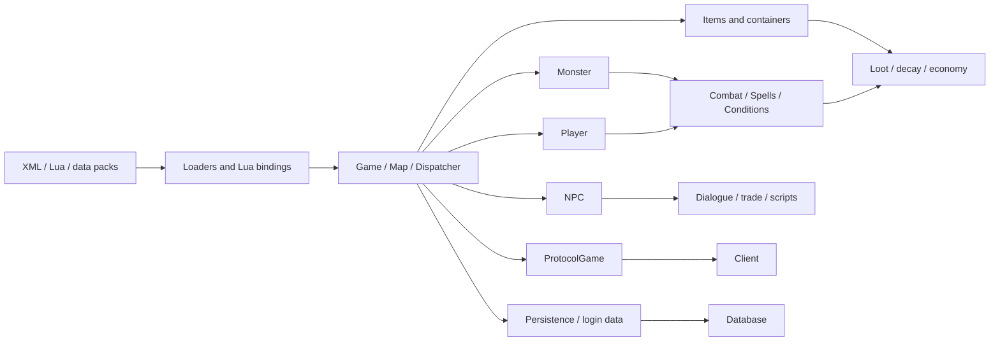
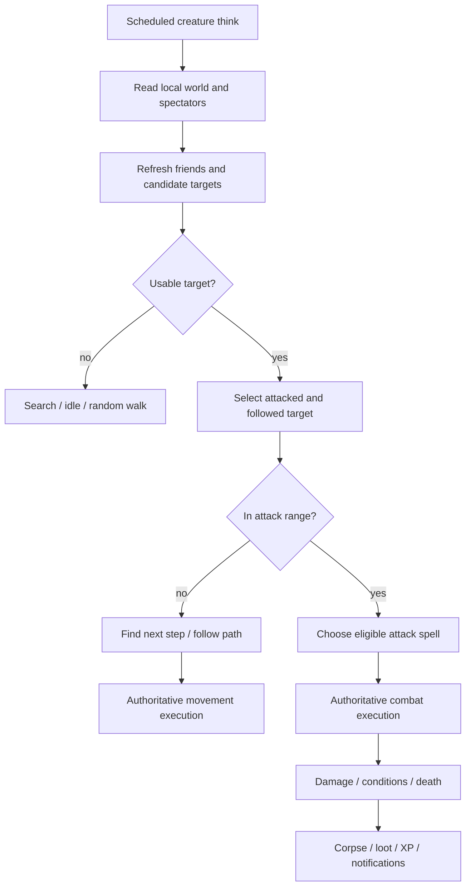
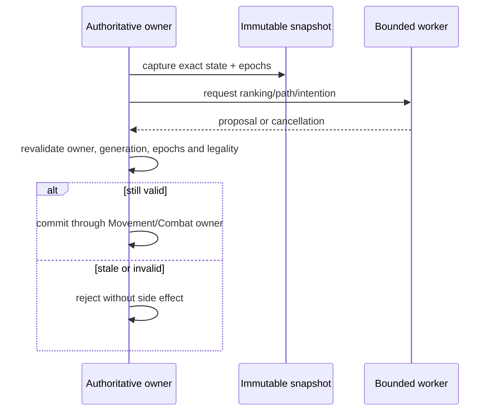
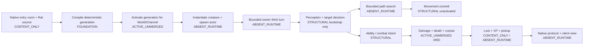

# Canary / CrystalServer Game-Module Source Audit and Oteryn Gap Map

- Status: `EVIDENCE AUDIT`; not an architecture acceptance and not implementation authority
- Audit date: 2026-09-26/27
- Oteryn baseline: `Oteryn/Oteryn-Game@d6c6c18eb1690208213b8871a30c992681ee4f2d`
- Canary baseline: `opentibiabr/canary@47dfd51f45280a59a1d3e50ba7edd573d7234446`
- CrystalServer baseline: `zimbadev/crystalserver@5e89bf8329ea406cb4ea8f4a18f32954f13e5418`
- Programme sources: Issues [#483](https://github.com/Oteryn/Oteryn-Game/issues/483), [#486](https://github.com/Oteryn/Oteryn-Game/issues/486), [#504](https://github.com/Oteryn/Oteryn-Game/issues/504) and Jira `KAN-15`
- Classification of Canary and CrystalServer: `OTS_HYPOTHESIS_ONLY`
- Production authority: `NONE`
- Code reuse authority: `NONE`

## 1. Plain-language result

Canary and CrystalServer are not two unrelated game engines. They share the classic Open Tibia Server/TFS architecture and a large common module surface. CrystalServer is the easier reference for the traditional, mostly inline monster loop. Canary is an evolutionary modernization of that same family: it adds bounded asynchronous computation, navigation snapshots, target ranking, combat-intention evaluation, relevance policy, scheduling budgets and telemetry, while still retaining large central classes such as `Monster`, `Game`, `Player` and `ProtocolGame`.

The mechanism discussed under `GAME-AI-01` is correctly called **creature AI**, **monster AI**, or the **NPC/creature decision loop**. In these servers, "AI" does not mean a neural network or generative model. It means deterministic game logic that observes nearby state, selects a target, chooses movement or an attack, and asks the authoritative game systems to execute it.

Oteryn already has strong authority, identity, content-compilation, multichannel and durability foundations. It also has a deliberately small pure-local AI bootstrap, an unactivated Movement proof and structural Ability/Combat work. It does **not** yet have one composed production loop that turns an admitted creature and spawn into a moving, attacking, dying and rewarding monster visible to the native client.

The shortest honest description is:

> Oteryn has several validated building blocks, but the creature gameplay conveyor belt is not connected yet.

This audit therefore recommends using:

- CrystalServer as a **behavior and module coverage checklist**;
- Canary as a **decomposition, cancellation and bounded-compute pattern source**;
- Oteryn contracts and accepted architecture as the **only authority** for identity, ownership, durability, limits, protocol and production behavior.

No Reference/Global gameplay parity is established by this audit.

## 2. Evidence language

| Label | Meaning in this audit |
|---|---|
| `PROVEN` | Directly observed in the pinned source or an exact Oteryn baseline file/state. |
| `DERIVED` | Calculated from full repository-tree/path inventories or from observed functions. |
| `INTERPRETATION` | Architectural meaning inferred from the proven evidence. |
| `UNKNOWN` | The evidence is insufficient for a parity or production claim. |
| `CONFLICT` | Two source indicators disagree and need explicit resolution. |

Oteryn coverage labels used below:

| Code | Meaning |
|---|---|
| `FOUNDATION` | Accepted and integrated supporting authority exists. |
| `STRUCTURAL` | Code/evidence exists but is private, unactivated or not composed into gameplay. |
| `CONTENT_ONLY` | Authoring/compilation/schema exists, but no production runtime consumer is proven. |
| `ACTIVE_UNMERGED` | Work is allocated or in a draft PR, but is not protected-main capability. |
| `OPEN_GATE` | A live design/resource/integration decision remains open. |
| `ABSENT_RUNTIME` | No production runtime implementation was found at the pinned baseline. |

## 3. Method and bounded scope

The audit used four passes:

1. full pinned Git-tree inventory for both upstream references;
2. extension/path comparison for C/C++, Lua and XML;
3. function/body review of approximately 65 high-value implementation units across monster, pathfinding, scheduling, combat, conditions, spells, spawns, map, player, NPC, items, economy, social, scripting, protocol and persistence;
4. exact comparison against the Oteryn baseline, current repository contracts and live task/PR state.

This is a source-level architecture audit, not an assertion that every line of every upstream C++ or Lua file was semantically reviewed.

### 3.1 Repository inventory

| Inventory | Canary | CrystalServer | Classification |
|---|---:|---:|---|
| Total files | 6,379 | 8,819 | `DERIVED` from full trees |
| C/C++ source/header paths (`.cpp/.hpp/.h/.cc`) | 559 | 455 | `DERIVED` |
| Exact `.cpp/.hpp` paths | 491 | 439 | `DERIVED` |
| Lua paths | 5,381 | 7,998 | `DERIVED` |
| XML paths | 120 | 186 | `DERIVED` |
| Shared `.cpp/.hpp` path names | 412 | 412 | `DERIVED`; path equality is not byte equality |
| Reference-content monster files | 1,656 under `data-otservbr-global` | 1,802 under `data-global` | `DERIVED` |
| Reference-content NPC files | 1,036 | 1,112 | `DERIVED` |
| Reference-content raid files | 88 | 152 | `DERIVED` |

Canary also has 67 monster files under `data-canary`. CrystalServer has 1,665 monster files under `data-crystal`. These are corpus counts, not admissions of accuracy, licensing, completeness or Oteryn runtime readiness.

### 3.2 Large-class indicators

The line and class-method counts below are architecture signals, not quality scores:

| Core unit | Canary | CrystalServer | Interpretation |
|---|---:|---:|---|
| `monster.cpp` | 4,014 lines / 252 class methods | 2,869 / 197 | Canary adds substantial orchestration and async/revalidation machinery. |
| combat | 2,885 / 117 | 2,994 / 107 | Both have mature, broad combat execution. |
| conditions | 2,955 / 179 | 2,826 / 180 | Very similar subsystem breadth. |
| spells | 1,654 / 152 | 1,621 / 151 | Very similar subsystem breadth. |
| `game.cpp` | 13,141 lines | 13,061 | Both retain a central game coordinator. |
| `player.cpp` | 13,456 / 877 | 13,267 / 906 | Player semantics remain highly concentrated. |
| `protocolgame.cpp` | 12,461 / 425 | 11,454 / 390 | Canary carries a larger protocol surface. |
| dispatcher | 1,192 / 57 | 265 / 21 | Canary has much more explicit scheduling/budget control. |

## 4. What the traditional OTS engine looks like

The classic architecture keeps an authoritative owner thread/game coordinator and executes a large amount of gameplay directly inside creature/player/game classes. Lua and XML are not secondary decoration: they provide a major part of monster, NPC, raid, action, movement-event and quest behavior.

## 5. Monster decision loop: CrystalServer versus Canary

### 5.1 Shared semantic loop

Both engines implement this recognizable cycle:

That loop is the practical meaning of "monster AI" here.

### 5.2 CrystalServer: traditional inline orchestration

`Monster::onThink` performs the main orchestration: base creature think, optional Lua callback, spawn/range eligibility, idle/walk decisions, summon handling or target search, then target, yelling, defense and sound behavior. `updateTargetList` cleans old weak references and scans spectators. `searchTarget` selects a configured strategy such as nearest, lowest health, most damage or random. `selectTarget` binds attacked/followed creatures and schedules checks. `doAttacking` iterates configured attack spells and performs range/chance checks before casting. `getNextStep` handles follow, back-off, random movement and push behavior.

The important characteristic is not that CrystalServer is "simple". It is broad and mature. The characteristic is that many decisions and side effects are close together in the monster owner flow.

### 5.3 Canary: the same semantics with asynchronous proposals

Canary retains the same recognizable monster behavior, but decomposes expensive or deferrable work:

- `onThink` performs the immediate eligibility/owner checks, then owner work is coalesced rather than producing catch-up bursts;
- target lists use stable references, state/decision epochs and parallel barrier work;
- target ranking is separated into a `MonsterTargetRanker` with nearest/health/damage modes, cancellation and faction offsets;
- combat eligibility is separated into `MonsterCombatIntentionEvaluator`; it produces an intention/proposal rather than executing the hit off-thread;
- relevance policy distinguishes visible and background work with hysteresis/hold behavior;
- pathfinding uses bounded A* over a navigation snapshot, supports cancellation and returns a proposal for owner-side revalidation;
- `MonsterComputeService` owns workers, priorities, submission, completion and statistics;
- dispatcher policies add budgets, telemetry and weighted scheduling.

The safe pattern is:

This is the most relevant Canary pattern for Oteryn. It aligns with Oteryn's accepted proposal/revalidation approach, but it does not authorize copying Canary code or adopting Canary's identity, scheduling or limit choices.

## 6. Module-by-module comparison and Oteryn gap map

| Game module | Canary / CrystalServer evidence | Oteryn at pinned baseline | What Oteryn still needs |
|---|---|---|---|
| World/map authority | Mature tile/map/spectator and zone runtime; centralized `Game`/`Map` ownership. | `FOUNDATION`: multichannel world model, distinct `WorldId`/`ChannelId`, immutable/shared versus Channel-owned boundaries. | Preserve Oteryn ownership model; do not import centralized OTS authority assumptions. |
| Content loading | XML/Lua/data loaders feed runtime objects directly. | `CONTENT_ONLY`: deterministic WorldProject/capture/compiler and native entry source exist. | Complete admitted generation activation and construct runtime actors from the pinned generation. |
| Creature definitions | Large monster corpora with stats, attacks, defenses, voices, summons, loot and scripts. | `CONTENT_ONLY`: one native Rat/room/spawn/behavior/ability/effect/item/loot/XP source plus candidate schemas and unpopulated indexes. | Activate the one-creature slice first; later admit broader content with per-field provenance and conflicts. |
| Spawn system | XML loading, startup, scheduled checks, zones, player proximity and cleanup in both engines. | `ABSENT_RUNTIME`: authored spawn evidence exists; no composed production population loop. | Owner-scoped bounded spawn occurrence, population key, deterministic retry/idempotency and actor creation. |
| Creature owner tick | Mature scheduled `onThink` lifecycle. | `ABSENT_RUNTIME`: no production creature think scheduler wired from `lib.rs` to a live actor. | One bounded Channel-owner turn with a stable occurrence identity and explicit budget. |
| Perception/spectators | Mature spectator scans and target-list refresh. Canary adds relevance policy. | `STRUCTURAL`: pure-local bounded candidate input exists only in the AI bootstrap. | Build an immutable Channel snapshot from authoritative actors; canonicalize candidates by semantic identity. |
| Target selection | Nearest/health/damage/random strategies; Canary has a separate ranker. | `STRUCTURAL`: deterministic `Idle` or `AcquireCandidate`, currently selecting from authored fixture candidates. | Connect real perception, target legality, factions and owner-side stale-target revalidation. |
| Threat/aggro | Mature attacked/followed target state and damage contribution behavior. | `ABSENT_RUNTIME`; permanent threat representation deliberately undecided. | Begin without a generalized threat table; add bounded retained threat only when one accepted behavior requires it. |
| Relevance/LOD | Canary visible/background tiers and scheduling policy; Crystal largely inline. | `OPEN_GATE`: accepted bounds exist for bootstrap evidence, not a production creature scheduler policy. | Measure one-room workload before selecting visible/background cadence and whole-cycle ceilings. |
| Pathfinding | Both have A*/path helpers; Canary separates snapshot path proposal, cancellation and bounds. | `STRUCTURAL`: `PathProposal` currently bounds/copies a caller-supplied route; it does not search. | Implement a bounded search over immutable navigation data, then revalidate and pass to Movement. |
| Movement | Mature follow, flee/back-off, random walk, pushing and tile legality. | `STRUCTURAL`: crate-private owner-turn Movement proof, unactivated and not creature-composed. Issue [#139](https://github.com/Oteryn/Oteryn-Game/issues/139) remains the resource lane. | Connect one creature step to authoritative occupancy/position while keeping accepted Movement limits and ownership. |
| Combat intention | Crystal checks/casts inline; Canary can compute eligibility as a proposal. | `STRUCTURAL`: GAME-AI-01 does not emit production Ability/Combat intent. | Define the minimal owner-validated AI-to-Ability command/result seam for one fixed attack. |
| Ability/spells | Broad instant/rune/combat-spell systems in both. | `STRUCTURAL`: private Ability code and typed owner-side commit evidence; not composed into the creature loop. | Activate only the fixed native ability/effect/formula first; keep foreign-domain commit authoritative. |
| Damage/combat | Mature target legality, area/chain, health/mana and condition handling. | `ACTIVE_UNMERGED`: structural fixed one-creature death/corpse work is draft PR [#950](https://github.com/Oteryn/Oteryn-Game/pull/950), explicitly nonshipping. | Independently qualify/integrate the exact candidate, then extend only through accepted playable requirements. |
| Conditions | Rich timed conditions, update, serialization and dispel. | `ABSENT_RUNTIME` for a composed Reference condition system. | Defer broad condition parity; implement only conditions required by the first playable attack and prove timing ownership. |
| Death/corpse | Mature damage-to-death ordering, corpse creation and lifecycle. | `ACTIVE_UNMERGED`: one retained corpse projection after one committed lethal occurrence in #950; no decay/persistence/restart. | Protect idempotency, then add acknowledged custody and only the minimum corpse lifecycle required by pickup. |
| Loot | Monster loot tables generate corpse/container contents. | `CONTENT_ONLY`: one item/loot definition and deterministic authoring evidence; no runtime loot commit. | Deterministic loot plan from exact content/RNG provenance, followed by authoritative Item/DUR mint. |
| XP/contribution | Damage attribution and XP distribution exist in the mature engines. | `CONTENT_ONLY` for one XP definition; no production contribution/reward commit. | Independent Character XP commit with retry/idempotency; do not infer OTS contribution semantics. |
| Pickup/item transfer | Mature item/container move/query rules and notifications. | `ABSENT_RUNTIME` for end-to-end corpse/ground pickup; DUR contracts/foundations exist. | Durable mint, explicit ground/corpse custody, retry-safe transfer and client reconciliation. |
| Items/containers/decay | Mature hierarchy, attributes, capacity, serialization and decay. | `FOUNDATION`/`STRUCTURAL` in durability contracts and evidence, not a complete gameplay runtime. | Add only the one accepted item path before broad item parity, then measure retained-resource limits. |
| NPC/dialogue/trade | Mature NPC object, Lua behavior and shop/dialogue flows. | `CONTENT_ONLY`/`ABSENT_RUNTIME`: source indexes/schema direction but no composed NPC runtime. | Later slice after creature combat journey; explicit dialogue/commerce authority and provenance. |
| Actions/movement events | Large Lua action, step-in/out, equip and use-item surfaces. | `ABSENT_RUNTIME` for general script parity. | Define explicit script context/capabilities; never allow a script to bypass domain ownership. |
| Quests/raids/bosses | Data/script-driven quests, raids and scheduled world events. | `CONTENT_ONLY`/`ABSENT_RUNTIME`; broad indexes are not runtime readiness. | Later explicit Instance/Channel/world scope, occurrence identity, recovery and reward ownership. |
| Party/guild/chat | Mature social systems and shared XP/loot/stat behavior. | Separate Oteryn product/platform contracts; not part of GAME-AI-01. | Do not pull social parity into the first creature slice. Integrate through accepted product boundaries later. |
| Bank/market/houses | Mature economy modules in both reference engines. | Platform owns commercial/control-plane responsibilities under accepted contracts. | Treat OTS code only as a feature checklist; do not import its authority model. |
| Persistence/login | Mature player/item/login persistence. | `FOUNDATION`: session-generation fencing, durability and identity contracts are stronger/different. | Keep Oteryn fencing and durable occurrence rules; no OTS persistence transplant. |
| Protocol/client | Large `ProtocolGame` implementations expose gameplay state to OTC/Tibia-style clients. | `ABSENT_RUNTIME`: native gameplay transport reports unavailable; issue [#642](https://github.com/Oteryn/Oteryn-Game/issues/642) is separate. | Publish the minimum authoritative state/commands for the first playable journey; do not clone OTS wire protocol. |
| Observability/budgets | Canary adds dispatcher budgets, policy and telemetry; Crystal is more traditional. | `FOUNDATION` for registered resource governance; production AI whole-cycle evidence is incomplete. | Instrument every bounded stage and derive numbers from representative Oteryn workload, not upstream constants. |

## 7. Oteryn's current creature pipeline

The diagram separates what is already protected-main capability from what is only structural, active elsewhere or absent.

Two common misunderstandings should be avoided:

1. a validated content schema or deterministic compiler does not mean the server has loaded and is running that content;
2. a pure-local AI test does not mean a live monster can perceive, move or attack.

## 8. What already exists in Oteryn

### 8.1 Strong foundations

`PROVEN` at the pinned baseline:

- `protocol-oteryn` is the target protocol and the world model is multichannel;
- `WorldId` and `ChannelId` remain distinct;
- character writes are session-generation fenced;
- `ChannelRuntimeV1` and current-owner actor-carrier structures exist, although the gameplay carrier remains pre-production;
- exact actor/generation lookup and typed owner-side commit evidence exist in focused slices;
- deterministic content capture/compiler and the committed native entry-room source exist;
- the native entry source includes exactly one bounded room journey with a Rat, spawn, behavior, presentation, ability/effect/formula, item, loot and XP definition;
- repository resource registries and governance gates exist.

### 8.2 Deliberately narrow structural slices

- `src/ai/mod.rs` is a pure-local deterministic bootstrap. It returns only `Idle` or `AcquireCandidate`; it cannot move, attack, spawn, persist, reward or mutate foreign domains.
- its current path proposal validates and retains an already supplied bounded route; it is not pathfinding.
- Movement is an unactivated owner-turn proof, not production creature movement.
- Ability/Combat evidence is not yet the end-to-end creature attack journey.
- `interaction` and AI are not production-wired from the crate root at the baseline.
- the server's default message still says native gameplay transport and executable gameplay slices are not integrated.

### 8.3 Live work must not be mistaken for protected capability

- the native content-activation work is allocated after the pinned main but is not included in this baseline;
- PR #950 is a draft exact-head structural death/corpse candidate, not merged production combat;
- issues [#508](https://github.com/Oteryn/Oteryn-Game/issues/508) and [#530](https://github.com/Oteryn/Oteryn-Game/issues/530) still carry production actor-resolution/carrier work;
- issue [#504](https://github.com/Oteryn/Oteryn-Game/issues/504) still governs Reference content profile/provenance work;
- issue [#822](https://github.com/Oteryn/Oteryn-Game/issues/822) remains the broader first-entry/control journey.

## 9. Minimum-sufficient implementation order

The goal is not to recreate the whole OTS engine. The goal is to prove one real, bounded, playable creature journey and then generalize only where evidence requires it.

### Phase 0 — preserve authority and provenance

- keep Canary/Crystal `OTS_HYPOTHESIS_ONLY`;
- retain source URL, exact revision, capture time, digest and per-field disposition for admitted Reference facts;
- resolve licensing/provenance before any direct reuse; this audit authorizes none;
- retain Oteryn identity, multichannel, session-generation, resource and durable-occurrence rules.

### Phase 1 — finish one admitted content generation

1. integrate/qualify native entry content activation;
2. pin one compiled generation to one admitted World/Channel;
3. instantiate exactly the authored room, one spawn and one Rat actor;
4. prove restart/refusal behavior for missing or mismatched activation evidence.

Exit evidence: an authoritative Channel owns the exact creature actor from the exact compiled generation. No movement or combat claim is needed yet.

### Phase 2 — build one bounded creature owner turn

1. introduce one finite scheduled creature-think occurrence;
2. snapshot only the local facts required by the Rat behavior;
3. canonicalize visible candidate identities;
4. call the deterministic AI decision;
5. revalidate exact owner/generation/content/map revisions before committing anything;
6. instrument admitted, deferred, stale, cancelled and committed work.

Do not start with a generalized behavior-tree framework, distributed AI service, persistent threat engine or ML model.

### Phase 3 — make navigation real

1. implement a bounded deterministic search over an immutable navigation snapshot;
2. return only a proposal with exact provenance and bounds;
3. reject stale proposals owner-side;
4. pass one cardinal step to authoritative Movement;
5. prove max/max+1, cancellation, fairness and no side effect on refusal.

Canary is the better pattern here; its numeric limits and implementation remain non-authoritative.

### Phase 4 — connect one attack

1. produce one minimal AI-to-Ability intent for the native Rat behavior;
2. revalidate target, range, owner/generation and exact content revision;
3. execute through the Ability/Combat owner;
4. commit damage once using deterministic occurrence/RNG provenance;
5. prove replay, stale target, stale owner and cancellation behavior.

### Phase 5 — complete death, reward and pickup

1. one lethal commit produces one death occurrence and one corpse projection;
2. build one deterministic loot plan from the admitted loot table;
3. mint one item through durable Item/DUR authority;
4. commit Character XP independently and idempotently;
5. establish explicit corpse/ground custody;
6. execute one retry-safe pickup transfer;
7. reconcile the authoritative result to the client.

This is the first point at which the phrase "a monster can be killed and looted" is justified.

### Phase 6 — expose the playable native-client journey

- add only the command/state messages needed to enter, see the Rat, move, attack, observe death/corpse/reward and pick up the item;
- preserve protocol registry, authentication, entitlement, liveness and control-loss gates;
- qualify the full path through a real client/server seam and exact protected candidate.

### Phase 7 — expand by vertical slices

After the one-creature journey is protected, add features in measured slices: more behavior modes/attacks/conditions, multiple spawns and population recovery, NPC/dialogue/trade, actions and movement events, quests/raids/bosses, richer items/decay, and only then broad Reference parity work.

## 10. What to decide now and what to defer

### Decide now

- the exact actor/spawn occurrence identities for the one-creature slice;
- the immutable snapshot fields and owner-side revalidation contract;
- the minimum AI-to-Movement and AI-to-Ability proposal envelopes;
- finite work accounting and instrumentation for every stage;
- the one-item loot/XP/pickup durability sequence;
- the minimum native protocol journey.

### Defer until executable evidence exists

- behavior tree versus FSM/statechart/planner framework;
- permanent threat-table representation;
- production visible/background cadence and scheduling policy;
- generalized boss/raid/encounter services;
- broad script API;
- machine-learning inference in the authoritative loop;
- Reference/Global parity claims.

Traditional deterministic AI can become more capable later without changing its authority model. Safe future improvements include richer scoring, bounded threat memory, coordinated group roles, utility selection, planners or offline-trained parameters. Any learned component should remain a bounded proposal producer whose output is validated by deterministic authoritative Movement/Ability/Interaction owners; it must not receive direct mutation authority.

## 11. Patterns worth adopting and patterns to reject

### Adopt conceptually

- Canary's immutable snapshot -> bounded worker -> owner revalidation -> commit pattern;
- cancellation, epochs/generations and stale-result refusal;
- explicit relevance/scheduling policy rather than accidental timing;
- deterministic target ordering before strategy selection;
- small first playable vertical slice;
- CrystalServer's broad module checklist to avoid forgetting ordinary gameplay systems.

### Reject or re-prove

- upstream IDs, protocol semantics, persistence schema or centralized ownership;
- upstream numeric budgets, cadence or performance assumptions;
- direct source copying without a resolved compatible-license/provenance decision;
- treating Lua/XML corpus size as correctness or Global parity;
- treating a schema validator or compiled content pair as runtime activation;
- treating worker-thread computation as authority;
- designing all classic OTS modules before one Oteryn creature journey is playable.

## 12. Licensing and provenance warning

Both upstream repository roots expose GPL-family licensing indicators. The CrystalServer repository-level metadata/license and at least one inspected source-file header do not describe the version in the same way (`CONFLICT`). Oteryn is MPL-2.0. This audit makes no legal compatibility conclusion and grants no copy/reuse permission.

Required disposition before any code-level reuse:

1. identify the exact file/component and its complete history;
2. resolve the applicable license/version and notices for that file;
3. establish provenance and whether the intended reuse is compatible with Oteryn distribution obligations;
4. prefer clean Oteryn implementation from behavior requirements and tests;
5. record any approved reuse explicitly.

Publicly visible game facts, wiki fields, OTS code and inferred Global behavior are different evidence classes. None should be silently promoted into another.

## 13. Final disposition

`PROVEN`: Canary and CrystalServer contain the traditional, mature OTS gameplay modules and monster loop. Canary adds meaningful decomposition and bounded asynchronous proposal machinery.

`PROVEN`: Oteryn has robust architectural foundations and several narrow structural slices, including a deterministic AI bootstrap and native one-room content source.

`PROVEN`: at the pinned Oteryn baseline, there is no composed production creature pipeline from admitted spawn through perception, path search, Movement, Ability/Combat, death, loot/XP/pickup and native client reconciliation.

`INTERPRETATION`: the best playable-first route is to connect one Rat vertical slice through existing Oteryn owners and contracts, borrowing only upstream patterns and coverage knowledge.

`UNKNOWN`: broad Reference/Global behavior parity, production scheduler capacities, complete content provenance, full corpse/loot/pickup behavior and client journey remain unproven.

`NO AUTHORITY`: this audit does not accept an architecture, activate content, select production resource numbers, copy upstream code, mutate runtime, merge a candidate or claim production readiness.
